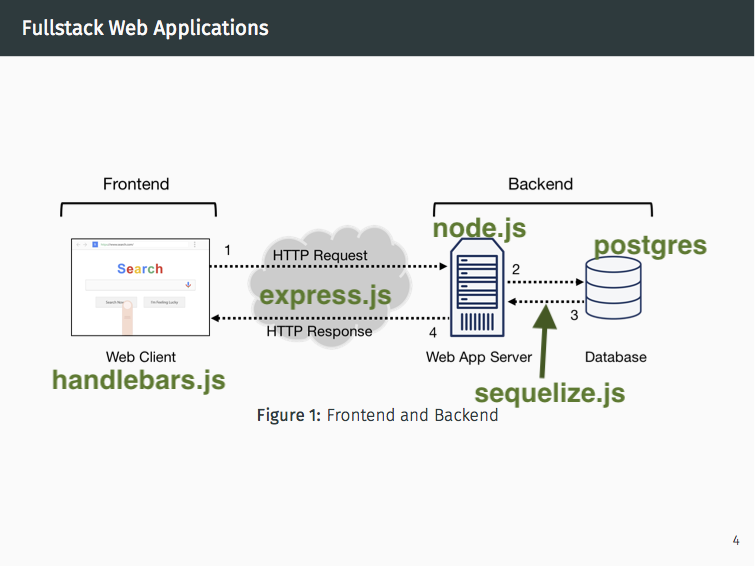

- [CUNYTechPrep Project Page for Polls App](https://github.com/CUNYTechPrep/week-06-projects)
- [PostgreSQL and NodeJS - Michael Herman](http://mherman.org/blog/2015/02/12/postgresql-and-nodejs/#.ViVUDxNViko)
- [Node, Postgres, and Sequelize - Michael Herman](http://mherman.org/blog/2015/10/22/node-postgres-sequelize/)
- [Node, Passport, and Postgres - Michael Herman](http://mherman.org/blog/2016/09/25/node-passport-and-postgres/#.WdvaohNSzv0)

* * *

- **CRUD** stands for Create, Retrieve, Update and Delete. It describes all the operations needed for a database application. 
- Each of these operations corresponds to the **http verbs** POST (Create New Entity), GET,  PUT(Update Existing Entity), Delete. 
- When using GET, POST, PUT, DELETE in API design, this is called **RESTful routing**
- **The Difference between REST and CRUD:** CRUD is a set primitive operations (mostly for databases and static data storages), while REST is a very-high-level API style (mostly for webservices and other 'live' systems). The first one manipulates data, the other interacts with a working system (url routes to create oop objects).
- My task today is to build these url routes with express.js which will interface with the postgres database I set up last time. 



* * *


## From the CTP Project Page:

### What we built

In some sections we built the `user` and `poll/question` association, in other sections we only built the `poll/question`and `choice` association. Both are good starting points.

The code in the `/poll-app` directory is based on the `/backend-starter-code`. In class, we developed code for the *models* and *controllers*, and instead of views, we used **Postman** to interact with our backend.

The files we added were: ==I need to understand everything that goes on in these files==

- `/models/polls.js`
- `/models/choices.js`
- `/controllers/polls.js`
- and we updated the `/config/config.json` file.

###  Tasks (due October 20, 2017) 

- ==I need to implement these features==


- Allow the user to update a Poll question text
  - Add a PUT route that allows this
- Allow the user to delete a Poll
  - Add the DELETE route that allows this
  - Should also delete the associated Choices

* * *


## ECMAScript 6 (ES6) Refresh

- I think it is finally necessary to go back and read the [ECMAScript 6 Tutorial](http://ccoenraets.github.io/es6-tutorial/). Because I'm not familiar with the JavaScript (or at least I forgot it if I ever did learn it). 
- ECMAscript 6 introduces **let** and alternative to **var** for declaring variables. let is block-scoped while var is function-scoped. (code from [MDN](https://developer.mozilla.org/en-US/docs/Web/JavaScript/Reference/Statements/let))

```javascript
function varTest() {
  var x = 1;
  if (true) {
    var x = 2;  // same variable! you just redeclared x as 2 everywhere in the function. 
    console.log(x);  // 2
  }
  console.log(x);  // 2
}

function letTest() {
  let x = 1;
  if (true) {
    let x = 2;  // different variable. x in the if block is different from x in the block above it
    console.log(x);  // 2
  }
  console.log(x);  // 1
}
```


### Arrow Functions

- before going into arrow functions and why they are needed in ECMAscript 6, I'm going to get into some background info.
- when you define a method to an object in javascript (Pre ECMAScript 6) you use the `function` keyword to define the method itself and any subroutines


```javascript
var obj = {
    string: "hello";
    myMethod: function () { // method definition
        setTimeout(function () { ... }, 0); //setTimeout is defined somewhere else 
        //the input of setTimeout is called a "subroutine" its a function we defined 
        // within our method definition (another function) both use function keyword
    }
}
```

- in javscript, functions are great for implementing functions becuase they have the `this` keyword which refers to the object the method is defined in. For example if you called `this.string` in the body of the function in line 3, `"hello"` would be returned. 
- Functions are not so great for subroutines, because subroutines don't have access to `this` to explain why requires understanding of lexical and dynamic scope. 


- **lexical scope versus dynamic scope** (from [stack exchange](https://stackoverflow.com/questions/1047454/what-is-lexical-scope))


```c++
//First, Lexical Scope (also called Static Scope), in C-like syntax:
//Every inner level can access its outer levels.
void fun(){
    int x = 5;
    void fun2(){
        printf("%d", x);
    }
}

//There is another way, called Dynamic Scope used by first implementation of Lisp, again in C-like Syntax:
//Here fun can either access x in dummy1 or dummy2, or any x in any function that call fun with x declared in it.

void fun(){
    printf("%d", x);
}

void dummy1(){
    int x = 5;
    fun();
}

void dummy2(){
    int x = 10;
    fun();
}
```

- when `this` is used in code, this happens dynamically; this refers to the object the function is called in/defined in. Subroutines can't access `this` because they aren't defined in objects (like methods are). Subroutines are defined in other functions.  Pre ECMAscript 6, the approach you had to take was to decalre another variable `var that = this;` (in line 5) within your method, so subroutines could access them. `var` makes `that` function-scoped (and is also lexically-scoped, the default for variables that aren't `this`). That means that every "level" at or below `var that = this;` has access to `that`. 

```javascript
var jane = {
    name: "Jane",

    logHello: function (friends) {
        var that = this;  // (*)
        friends.forEach(function (friend) {
            console.log(that.name + " says hello to " + friend)
        });
    }
}
```

- So this kind of *simulates* a lexical `this`. which would be available in nested function definitions. However there are some problems with only *simulating* it.
  - you have to know this quirk.
  - You have to be careful about scope when writing subroutines.
  - There is more to type and more visual clutter.
- **arrow functions** solve the problem with `this` in subroutines. In the example below, you can see we define a subroutine within the function at `logHello` that accesses `this` directly. 

```javascript
let jane = {
    name: "Jane",

    logHello: function (friends) {
        friends.forEach(friend => {
            console.log(this.name + " says hello to " + friend)//this.name returns "Jane"
        });
    }
}
```

- for more on javascript scope if you're confused about the differences between block, function, lexical and dynamic: [JavaScript Scope – Lexical Scoping, Closures, & Controlling Context](https://spin.atomicobject.com/2014/10/20/javascript-scope-closures/)


### Modules

- modules are just like libraries in python. They contain lots of reuseable functions. 
- ECMAscript 6 supports modules, but older versions of javascript don't. Previos versions of js had 3rd party libraries that allowed importing modules. [Webpack](http://webpack.github.io) and [Browserify](http://browserify.org) are two popular examples. Using these libraries with [Babel](https://babeljs.io) will allow you to compile to ECMAscript 5 for compatibility with current browsers (for front end—views). In the back end you don't need Babel, Webpack or Browserify because [Node](https://nodejs.org) is compatible with modules because of [CommonJS](http://requirejs.org/docs/commonjs.html). 

#### Node Modules

- In node.js you can make your own modules by using the `exports` keyword to make properties and methods available outside of the current file. Example code below from [w3schools](https://www.w3schools.com/nodejs/nodejs_modules.asp):

```javascript
exports.myDateTime = function () {
    return Date();
};
```

- if you want to import a module in node use `require` and the name of the module in single quotes. The code in the example below allows access to the HTTP module which supplies methods that allow you to create a server.

```javascript
var http = require('http');
```


#### ECMAScript 6 Modules

- in ES6 you export modules like this (all in the mortgage.js module):

```javascript
export let calculateMonthlyPayment = (principal, years, rate) => {
    let monthlyRate = 0;
    if (rate) {
        monthlyRate = rate / 100 / 12;
    }
    let monthlyPayment = principal * monthlyRate / (1 - (Math.pow(1/(1 + monthlyRate),
            years * 12)));
    return {principal, years, rate, monthlyPayment, monthlyRate};
};
```

- in ES6 you import modules as shown in the example below. Notice the `*` that means that all modules exported in the mortgage.js module will be imported into this document. Also notice that `./mortage` doesn't have a `.js` after it. It's assumed that you're importing javascript files. 

```javascript
import * as mortgage from './mortgage';
```


### Classes 

- classes in ES6 are pretty simple to use just define a constructor and class methods as in the example below. 

```javascript
class Mortgage {
    
    constructor(principal, years, rate) {
        this.principal = principal;
        this.years = years;
        this.rate = rate;
    }
    
    get monthlyPayment() {
        let monthlyRate = this.rate / 100 / 12;
        return this.principal * monthlyRate / (1 - (Math.pow(1/(1 + monthlyRate),
                    this.years * 12)));
    }
    
    get amortization() {
        let monthlyPayment = this.monthlyPayment;
        let monthlyRate = this.rate / 100 / 12;
        let balance = this.principal;
        let amortization = [];
        for (let y=0; y<this.years; y++) {
            let interestY = 0;
            let principalY = 0;
            for (let m=0; m<12; m++) {
                let interestM = balance * monthlyRate;
                let principalM = monthlyPayment - interestM;
                interestY = interestY + interestM;
                principalY = principalY + principalM;
                balance = balance - principalM;
            }
            amortization.push({principalY, interestY, balance});
        }
        return amortization;
    }
    
}
```

- node doesn't yet have class capabilities, so won't be able to use it in this project unless I import some inheritance libraries. 


### Promises

- Promises allow you to handle synchronous calls. What that means is that you can put a placeholder in your code that waits for something to happen (like a get a request to your server) and will execute only after it happens. Promises come baked into ES6, but you have to include a library to use them in node.
- Promises have a very similar syntax to the routing calls in [Express.js](http://expressjs.com) and that's for good reason; they're both asynchronous processes. You don't have to install promises in node to use Express.js routing though. 

#### Node Promises

- run this `npm install promise --save ` the terminal to install promises on node


- then in your code include the require statement `var Promise = require('promise');`
- the example below shows how you might declare a promises in node

```javascript
var readFile = Promise.denodeify(require('fs').readFile);
// now `readFile` will return a promise rather than
// expecting a callback
```


#### ECMAscript 6 Promises

- the code below explains how to declare a promise with two functions (defined elsewhere) as input resolve and reject. 
- After declaring a promise, you can use `then` to take further when the promise is resolved, without adding to the `resolve` function itself. (Code from [MDN](https://developer.mozilla.org/en-US/docs/Web/JavaScript/Reference/Global_Objects/Promise#Basic_Example))

```javascript
let myFirstPromise = new Promise((resolve, reject) => {
  // We call resolve(...) when what we were doing asynchronously was successful, and reject(...) when it failed.
  // In this example, we use setTimeout(...) to simulate async code. 
  // In reality, you will probably be using something like XHR or an HTML5 API.
  setTimeout(function(){
    resolve("Success!"); // Yay! Everything went well!
  }, 250);
});

myFirstPromise.then((successMessage) => {
  // successMessage is whatever we passed in the resolve(...) function above.
  // It doesn't have to be a string, but if it is only a succeed message, it probably will be.
  console.log("Yay! " + successMessage);
});
```


* * *


## [Express.js](http://expressjs.com) Run-through 


### Anatomy of a Router 

- Routers, written in express for this project, are our controllers. Routing refers to determining how an application responds to a client request to a particular endpoint, which is a URI (or path) and a specific HTTP request method (GET, POST, and so on).
- `app.METHOD(PATH, HANDLER)` is the syntax for a route definition.
  - `app` is an instance of express.
  - `METHOD` is a lowercase HTTP request method. (get,put,post,delete, etc... there are [more](https://en.wikipedia.org/wiki/Hypertext_Transfer_Protocol#Request_methods))
  - `PATH` is a path on the server.
  - `HANDLER` is the function executed when the route is matched.

```Java
//Respond to GET request with Hello World! on the homepage:
app.get('/', function (req, res) {
  res.send('Hello World!')
})
//Respond to POST request on the root route (/), the application’s home page:
app.post('/', function (req, res) {
  res.send('Got a POST request')
})
//Respond to a PUT request to the /user route:
app.put('/user', function (req, res) {
  res.send('Got a PUT request at /user')
})
//Respond to a DELETE request to the /user route:
app.delete('/user', function (req, res) {
  res.send('Got a DELETE request at /user')
})
```


### Middleware

- Notice the handlers have the syntax `function(req, res){function body}` . The handler is also called **middleware** when it has access to the [request object](http://expressjs.com/en/4x/api.html#req) (`req`), the [response object](http://expressjs.com/en/4x/api.html#res) (`res`), and the `next` function. Middleware takes control from one function and passes it to another, acting as a liason between them, hence "middle".
- The `next` function is a function in the Express router which, when invoked, executes the middleware succeeding the current middleware. as per the following example (code from writing middleware [express documentation](http://expressjs.com/en/guide/writing-middleware.html)):

```javascript
var express = require('express')
var app = express()

//defined middleware function outside of the router
var myLogger = function (req, res, next) {
  console.log('LOGGED')
  next()// have to call next when writing middleware otherwise the function will stall
}

//this calles the middleware "myLogger" and then with "next()" allows the router to execute.
app.use(myLogger)

//here's the router
app.get('/', function (req, res) {
  res.send('Hello World!')
})

app.listen(3000)
```

- Note: In the code above, because we are using app.use() and because it comes before the get router, myLogger will be used on every RESTful request, including the get router. So for example if I wanted to issue an HTTP request `GET` to the homepage `/` first it would be logged with `myLogger` and then a response would be sent `"Hello World!"`.
- There's lots of 3rd party middleware that can help with things like cookies. Check the [using middleware](https://expressjs.com/en/guide/using-middleware.html) page for info on that and other stuff. 


### next() ≠ then() Middleware & Promises

- so `next()` as stated before is part of defining middle ware, which is slightly different from promises which used `then()` ==I'm not to clear on what the difference is== 
- there's more on promises in express [here](https://expressjs.com/en/advanced/best-practice-performance.html#use-promises) but it links to a page that says I have to use q module. 


- What I don't understand is how is it you can use promises in this code withoug calling `var Promise = require('promise');` or `var Promise = require('q');` or some module that could make asynchronous calls possible. ==Was I wrong? Is it included in node by default now?== I think the promises may be implemented in Sequelize. I'm curious if Sequelize relies on yet another 3rd party library or if it does the promises itself.

```javascript
// from /controllers/polls.js 
router.get('/', (req, res) => {
  models.Polls.findAll()
    .then((allPolls) => {
      res.json(allPolls);
    })
});
```

- `next()` is an express thing `then()` is a promises thing. 
- next doesn't wait immediately executes next middleware. otherwise it stops.
  - for chaining 
- then waits for input. for asynchronous actions.
- ES6 contains promises. on node, anywhere. 
- babel detects whether babel compiliing is necessary or if browser needs babel
- pay attentino to the date of the tutorial especially pre 2017.
  - q was a promises library 
  - bluebird was sequelizes thing for promises 
  - if you  var Promise = require('q'); then you're overwriting methods included in node
- all libraries use native environment components so sequelize uses bluebird on older environments but uses es6 promises on updated systems 

### Starting Express

1. Require express `const express = require('express')`

2. Declare an instance of the express object `const app = express()`

3. Create a route:
   ```javascript
   app.get('/', function (req, res) { //looks for requests at root '/' and executes request or response function depending
     res.send('Hello World!') 
   })
   ```

4. Tell the server where to listen for connections:

   ```javascript
   app.listen(3000, function () { 
     console.log('Example app listening on port 3000!') //prints to console
   })
   ```

5. start the server with `node app.js` or `npm start` or whatever.

* * *


## Sequelize.js 

### ==Questions==

- Why is it that there's no .sequelizerc file in the root folder of the polls-app? Isn't that necessary for specifying the locations of files required by Sequelize?
  - for changing global default behavior 
    - like camel case
- Is there some documentation that explains the contents of the models/index.js file line by line? The sequelize tutorial doesn't say anything.
- Why is it in ES6 you use `export let functionName = (parameters) => {function body}` in Node you use `exports.functionName = (parameters)=>{function body}` and in the sequelize model files you use `module.exports = (parameters) => {function body}`. What accounts for the differences here?
  - second one is weird, in our project we will use the sequelize thing
  - might need to send question on slack have a look later on


### Creating a Model

- the function `sequelize.define();`takes three parameters as input:
  - the name of the model `'Todo'` in this case
  - an object with attributes that belong to the model `{title: DataTypes.STRING, complete: DataTypes.BOOLEAN}`
  - and any class methods also passed in an object `{classMethods: {associate: function(models) {//assosciate function body}}`

```javascript
'use strict';
module.exports = function(sequelize, DataTypes) {
  var Todo = sequelize.define('Todo', {
    title: DataTypes.STRING,
    complete: DataTypes.BOOLEAN
  }, {
    classMethods: {
      associate: function(models) {
        // associations can be defined here
      }
    }
  });
  return Todo;
};
```


###  Associations (many to one...) 

- if there's a one to many or many to many relationship between two models, you account for that in the assosciation class methods. 
- Example: one user can have many todos. In this case the comment in line 9 of the above code could be replaced with `Todo.belongsTo(models.User);`
- Then a user model (in another file user.js) could be made that looks like:

```javascript
'use strict';
module.exports = function(sequelize, DataTypes) {
  var User = sequelize.define('User', {
    email: DataTypes.STRING
  }, {
    classMethods: {
      associate: function(models) {
        User.hasMany(models.Todo); //notice this line that relates the user back to todos
      }
    }
  });
  return User;
};
```


###  Create, Retrieve Update & Delete

- After sequelize is set up and the models are defined, you can write the routes (or controllers). 

  ​